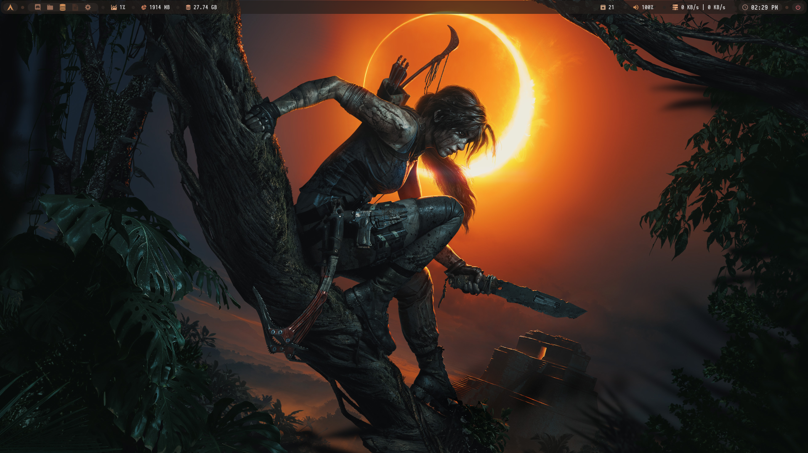
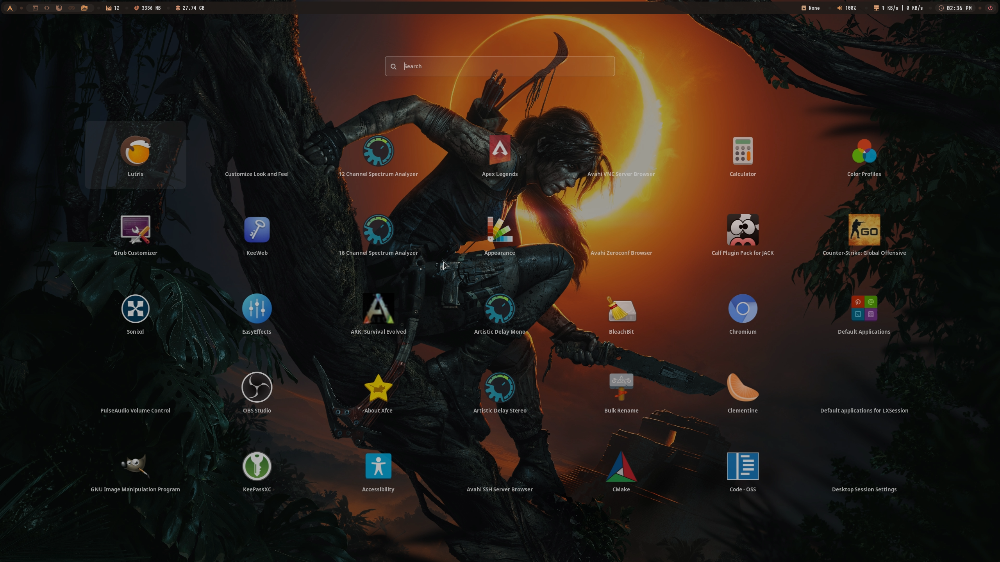
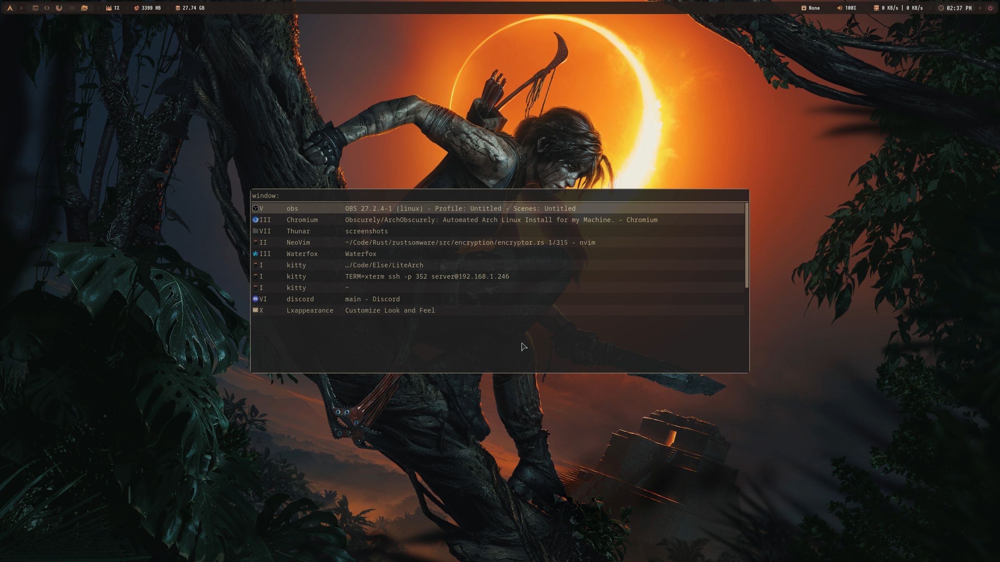
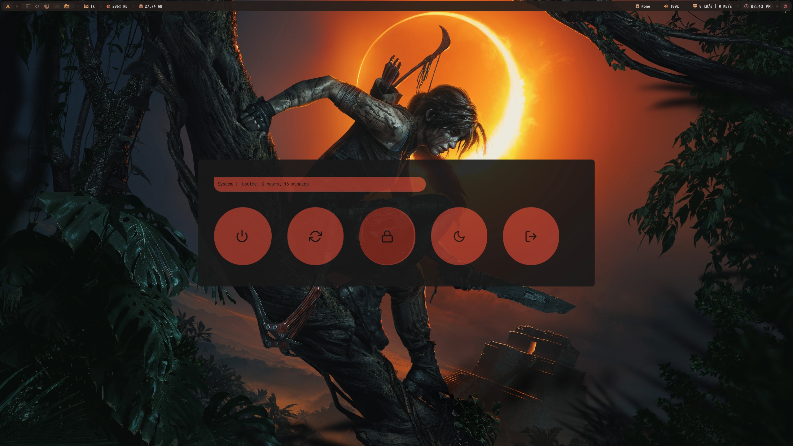
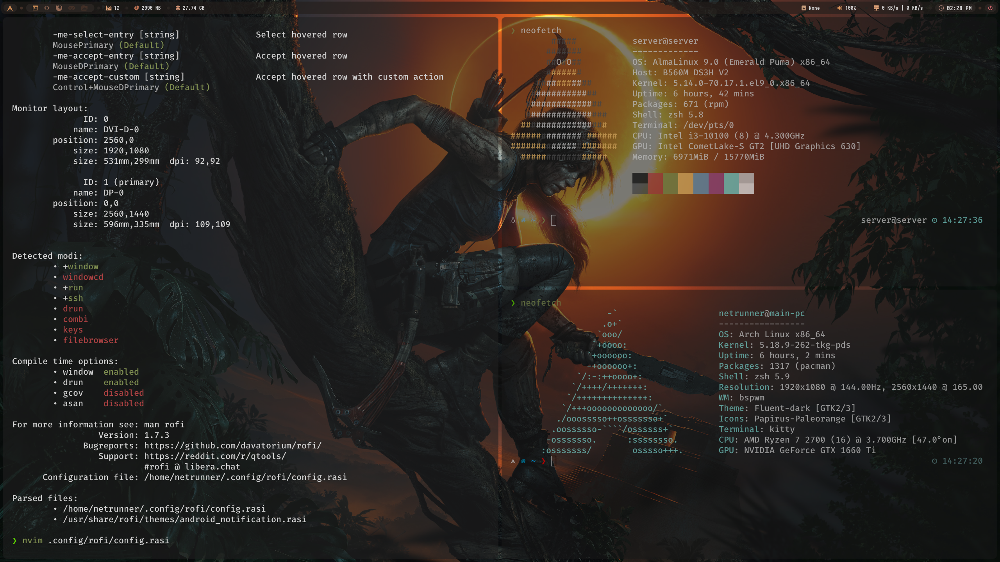
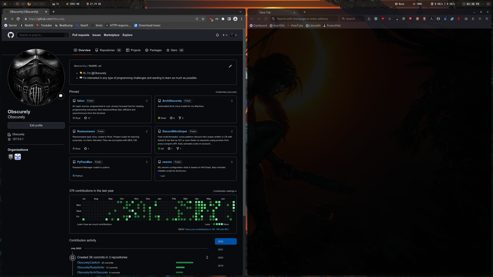
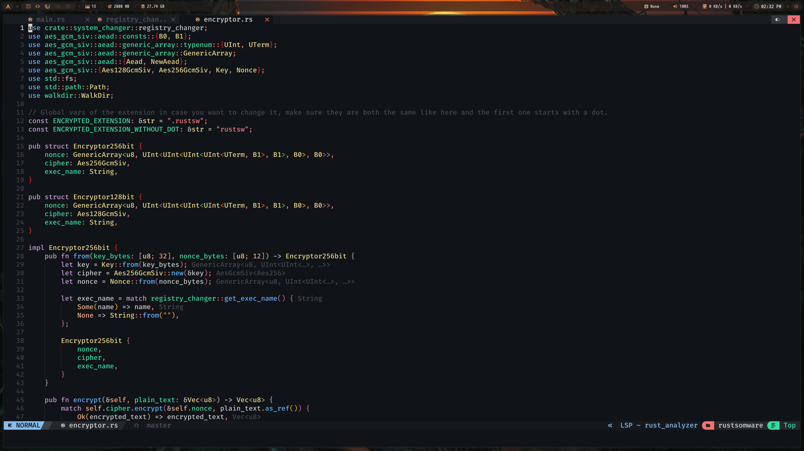

# LiteArch
Arch install script for my laptop, removed some pkgs + changed the theme a little.

## How to use it on your machine
Just change everything in the first file regarding the paritioning. In the second file just change the first line to your grub partition (boot). In order to make it easier you can fork this to apply your changes.

## How to use the script
First download the arch iso and run it, obviously. Then run this commands.

```shell
sudo pacman -S archlinux-keyring
```
```shell
sudo pacman -Sy git
```
```shell
git clone https://github.com/Obscurely/ArchObscurely
```
```shell
cd ArchObscurely
```
And now run the install script wait for any prompts during installation, should take about 5-15 minute or up to an hour depending on your machine
```shell
./archobscurely.sh
```
## Screenshots

### Desktop 1


### Desktop 2


### App launcher


### Quick apps


### App switcher


### Power Menu


### Date & Time


### Terms side by side


### Browsers side by side


### IDE

